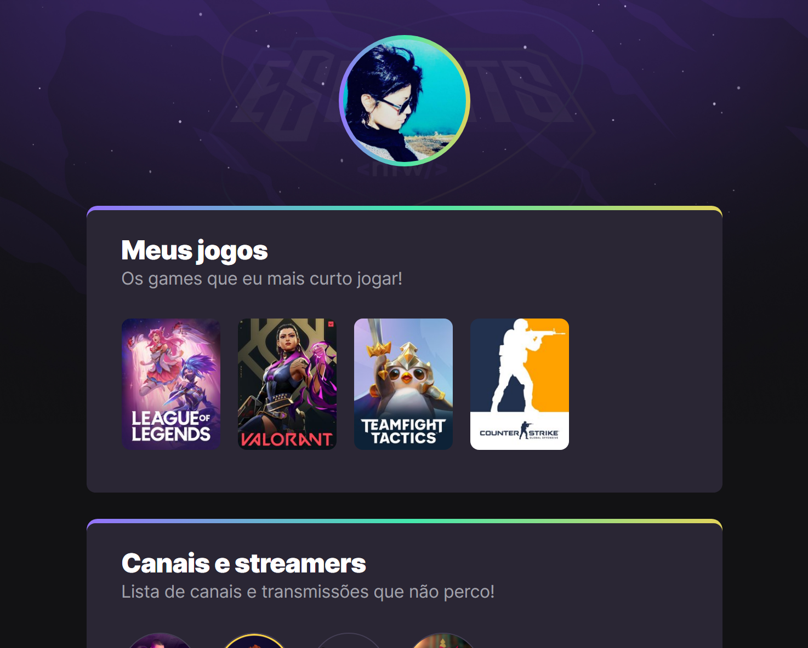

# NLW Esports - Trilha Explorer

 Projeto executado durante evento Next Level Week da  Rocketseat 

[Acesse aqui](https://patyalvesena.github.io/NLW/)

 ## Tecnologias utilizadas.

- HTML
- CSS
- Git e Github

### Novos conhecimentos obtidos com projeto!

CSS 
- @Keyframes
- Animações
- Linear-gradient

GIT e Github
- Conceitos sobre GIT e Github
- Primeiros passos na utilização.
- Readme.md
- Renderização via Github.

### Informações e contato.

[Linkedin](https://www.linkedin.com/in/patriciaalvessenamachado/)

Email- patyalvesena@gmail.com

[Whatsapp](https://wa.me/5541991018918)
